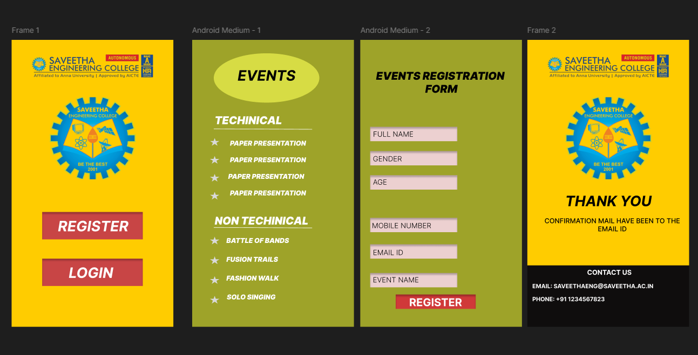

# Ex09 Event Registration Web Application
## Date:25-12-25
## REF:25012833

## AIM:
To design, develop and deploy a web application for event registration.

## DESIGN STEPS:

### Step 1:
Create a new frame.

### Step 2:
Select any one preset size of your choice.

### Step 3:
Select the shapes you need.

### Step 4:
Import images as needed.

### Step 5:
Create pages based on your need and link them.

### Step 6:

Validate the HTML and CSS code.

### Step 6:

Publish the website in the given URL.

## DESIGN TOOL:
Figma

## CODE:
~~~

  
  

  
REGISTER

  

  
LOGIN

  

.frame-1,
.frame-1 * {
  box-sizing: border-box;
}
.frame-1 {
  background: #ffcc00;
  height: 640px;
  position: relative;
  overflow: hidden;
}
.th-removebg-preview-1-1 {
  width: 284px;
  height: 55px;
  position: absolute;
  left: 38px;
  top: 31px;
  object-fit: cover;
}
.rectangle-1 {
  background: #c84545;
  width: 224px;
  height: 61px;
  position: absolute;
  left: 68px;
  top: 384px;
  box-shadow: inset 0px 4px 4px 0px rgba(0, 0, 0, 0.25);
}
.register {
  color: #ffffff;
  text-align: left;
  font-family: "Inter-BoldItalic", sans-serif;
  font-size: 32px;
  font-weight: 700;
  font-style: italic;
  position: absolute;
  left: 103px;
  top: 396px;
  width: 173px;
  height: 19px;
}
.rectangle-2 {
  background: #c84545;
  width: 224px;
  height: 61px;
  position: absolute;
  left: 68px;
  top: 488px;
  box-shadow: inset 0px 4px 4px 0px rgba(0, 0, 0, 0.25);
}
.login {
  color: #ffffff;
  text-align: left;
  font-family: "Inter-BoldItalic", sans-serif;
  font-size: 32px;
  font-weight: 700;
  font-style: italic;
  position: absolute;
  left: 127px;
  top: 500px;
  width: 173px;
  height: 19px;
}
.saveetha-logo-removebg-preview-1-1 {
  width: 191px;
  height: 183px;
  position: absolute;
  left: 85px;
  top: 128px;
  object-fit: cover;
}

  

  
EVENTS

  
  
  
  
  

  
TECHINICAL

  
  
  
  
  

  
NON TECHINICAL

  
PAPER PRESENTATION

  
PAPER PRESENTATION

  
PAPER PRESENTATION

  
PAPER PRESENTATION

  
BATTLE OF BANDS

  
SOLO SINGING

  
FASHION WALK

  
FUSION TRAILS

 .android-medium-1,
.android-medium-1 * {
  box-sizing: border-box;
}
.android-medium-1 {
  background: #9ea329;
  height: 640px;
  position: relative;
  overflow: hidden;
}
.ellipse-1 {
  background: #d7dc44;
  border-radius: 50%;
  width: 235px;
  height: 110px;
  position: absolute;
  left: 48px;
  top: 30px;
}
.events {
  color: #000000;
  text-align: left;
  font-family: "Inter-BoldItalic", sans-serif;
  font-size: 32px;
  font-weight: 700;
  font-style: italic;
  position: absolute;
  left: 101px;
  top: 60px;
}
.star-1 {
  width: 22px;
  height: 19px;
  position: absolute;
  left: 39px;
  top: 219px;
  overflow: visible;
}
.star-4 {
  width: 22px;
  height: 19px;
  position: absolute;
  left: 39px;
  top: 339px;
  overflow: visible;
}
.star-3 {
  width: 22px;
  height: 19px;
  position: absolute;
  left: 39px;
  top: 299px;
  overflow: visible;
}
.star-2 {
  width: 22px;
  height: 19px;
  position: absolute;
  left: 39px;
  top: 259px;
  overflow: visible;
}
.line-1 {
  margin-top: -1px;
  border-style: solid;
  border-color: #ffffff;
  border-width: 1px 0 0 0;
  width: 219px;
  height: 0px;
  position: absolute;
  left: 48px;
  top: 199px;
  transform-origin: 0 0;
  transform: rotate(0.262deg) scale(1, 1);
}
.techinical {
  color: #ffffff;
  text-align: left;
  font-family: "Inter-BlackItalic", sans-serif;
  font-size: 24px;
  font-weight: 900;
  font-style: italic;
  position: absolute;
  left: 50px;
  top: 165px;
}
.star-5 {
  width: 22px;
  height: 19px;
  position: absolute;
  left: 39px;
  top: 439px;
  overflow: visible;
}
.star-6 {
  width: 22px;
  height: 19px;
  position: absolute;
  left: 39px;
  top: 571px;
  overflow: visible;
}
.star-7 {
  width: 22px;
  height: 19px;
  position: absolute;
  left: 39px;
  top: 527px;
  overflow: visible;
}
.star-8 {
  width: 22px;
  height: 19px;
  position: absolute;
  left: 39px;
  top: 483px;
  overflow: visible;
}
.line-2 {
  margin-top: -1px;
  border-style: solid;
  border-color: #ffffff;
  border-width: 1px 0 0 0;
  width: 219px;
  height: 0px;
  position: absolute;
  left: 48px;
  top: 419px;
  transform-origin: 0 0;
  transform: rotate(0.262deg) scale(1, 1);
}
.non-techinical {
  color: #ffffff;
  text-align: left;
  font-family: "Inter-BlackItalic", sans-serif;
  font-size: 24px;
  font-weight: 900;
  font-style: italic;
  position: absolute;
  left: 50px;
  top: 389px;
  width: 293px;
  height: 75px;
}
.paper-presentation {
  color: #ffffff;
  text-align: left;
  font-family: "Inter-BlackItalic", sans-serif;
  font-size: 15px;
  font-weight: 900;
  font-style: italic;
  position: absolute;
  left: 84px;
  top: 222px;
  width: 203px;
  height: 32px;
}
.paper-presentation2 {
  color: #ffffff;
  text-align: left;
  font-family: "Inter-BlackItalic", sans-serif;
  font-size: 15px;
  font-weight: 900;
  font-style: italic;
  position: absolute;
  left: 84px;
  top: 333px;
  width: 203px;
  height: 32px;
}
.paper-presentation3 {
  color: #ffffff;
  text-align: left;
  font-family: "Inter-BlackItalic", sans-serif;
  font-size: 15px;
  font-weight: 900;
  font-style: italic;
  position: absolute;
  left: 80px;
  top: 296px;
  width: 203px;
  height: 32px;
}
.paper-presentation4 {
  color: #ffffff;
  text-align: left;
  font-family: "Inter-BlackItalic", sans-serif;
  font-size: 15px;
  font-weight: 900;
  font-style: italic;
  position: absolute;
  left: 84px;
  top: 259px;
  width: 203px;
  height: 32px;
}
.battle-of-bands {
  color: #ffffff;
  text-align: left;
  font-family: "Inter-BlackItalic", sans-serif;
  font-size: 15px;
  font-weight: 900;
  font-style: italic;
  position: absolute;
  left: 76px;
  top: 439px;
  width: 203px;
  height: 32px;
}
.solo-singing {
  color: #ffffff;
  text-align: left;
  font-family: "Inter-BlackItalic", sans-serif;
  font-size: 15px;
  font-weight: 900;
  font-style: italic;
  position: absolute;
  left: 77px;
  top: 565px;
  width: 203px;
  height: 32px;
}
.fashion-walk {
  color: #ffffff;
  text-align: left;
  font-family: "Inter-BlackItalic", sans-serif;
  font-size: 15px;
  font-weight: 900;
  font-style: italic;
  position: absolute;
  left: 76px;
  top: 523px;
  width: 203px;
  height: 32px;
}
.fusion-trails {
  color: #ffffff;
  text-align: left;
  font-family: "Inter-BlackItalic", sans-serif;
  font-size: 15px;
  font-weight: 900;
  font-style: italic;
  position: absolute;
  left: 76px;
  top: 481px;
  width: 203px;
  height: 32px;
}
~~~

## OUTPUT:

## RESULT:
The program to design, develop and deploy a web application for event registration is completed successfully.
